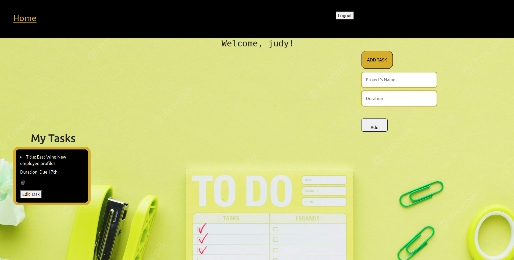

# TASK TRACKER
 ## Judy Mwai
## Screenshot
 <!--  -->
 
 

 
 ## Table of Content
 - [Description](#description)
 - [Features](#features)
 - [Behaviour Driven Development](#Behaviour-Driven-Development)
 - [Requirements](#requirements)
 - [Installation Process](#installation-Process)
 - [Live Link](#Live-Link)
 - [Technology  Used](#technology-Used)
 - [Licence](#licence)
 - [Authors Info](#Authors-Info)
 ## Description
 
The work of the app is to help a user be  more organized. The app enables a user to create a schedule of the tasks or projects at hand. After completing a task, the user can mark off the task and move on to another. The app is secure and personal in that , no other person has access to another person’s profile

## Features
sign up and login page
User Profile
Logout

 ###  Requirements
 * Access to  a computer
 * Access to internet
 ### Installation Process
 ****
* Clone to the repo : git clone https://github.com/Juddymwai/Task-Tracker-App
* Unzip the downloaded files in a folder of choice.
* Open the index file from the zipped file with any browser.
 ****
 
### Live Link
- Click this link to view the live application https://client-side-task-app.vercel.app/
### Technology  Used
*RAILS - to build backend 
*REACT 	- to create the single page application 
*CSS - to style the app

## Licence
Copyright (c) [2022] [Judy Mwai] 
Permission is hereby granted, free of charge, to any person obtaining a copy
of this software and associated documentation files (the "Software"), to deal
in the Software without restriction, including without limitation the rights
to use, copy, modify, merge, publish, distribute, sublicense, and/or sell
copies of the Software, and to permit persons to whom the Software is
furnished to do so, subject to the following conditions:
The above copyright notice and this permission notice shall be included in all
copies or substantial portions of the Software.
THE SOFTWARE IS PROVIDED "AS IS", WITHOUT WARRANTY OF ANY KIND, EXPRESS OR
IMPLIED, INCLUDING BUT NOT LIMITED TO THE WARRANTIES OF MERCHANTABILITY,
FITNESS FOR A PARTICULAR PURPOSE AND NONINFRINGEMENT. IN NO EVENT SHALL THE
AUTHORS OR COPYRIGHT HOLDERS BE LIABLE FOR ANY CLAIM, DAMAGES OR OTHER
LIABILITY, WHETHER IN AN ACTION OF CONTRACT, TORT OR OTHERWISE, ARISING FROM,
OUT OF OR IN CONNECTION WITH THE SOFTWARE OR THE USE OR OTHER DEALINGS IN THE
SOFTWARE.

## Authors Info
Slack Profile - Judy Mwai
github profile- Juddymwai
